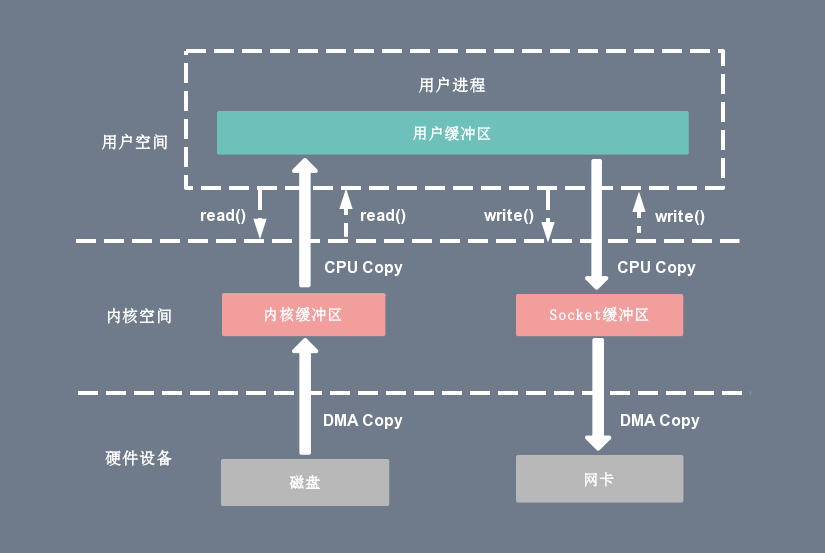

## BIO

System.out\in\err   
Scanner    工具类，底层nio读取输入


## Linux I/O 读写方式
Linux 提供了轮询、I/O 中断以及 DMA 传输这 3 种磁盘与主存之间的数据传输机制。其中轮询方式是基于死循环对 I/O 端口进行不断检测。

I/O 中断方式是指当数据到达时，磁盘主动向 CPU 发起中断请求，由 CPU 自身负责数据的传输过程。

DMA 传输则在 I/O 中断的基础上引入了 DMA 磁盘控制器，由 DMA 磁盘控制器负责数据的传输，降低了 I/O 中断操作对 CPU 资源的大量消耗。

### IO中断


* 每次用户进程读取磁盘数据时，都需要 CPU 中断，然后发起 I/O 请求等待数据读取和拷贝完成， 每次的 I/O 中断都导致 CPU 的上下文切换：
用户进程向 CPU 发起 read 系统调用读取数据，由用户态切换为内核态，然后一直阻塞等待数据的返回。

* CPU 在接收到指令以后对磁盘发起 I/O 请求，将磁盘数据先放入磁盘控制器缓冲区。 数据准备完成以后，磁盘向 CPU 发起 I/O 中断。

* CPU 收到 I/O 中断以后将磁盘缓冲区中的数据拷贝到内核缓冲区，然后再从内核缓冲区拷贝到用户缓冲区。

* 用户进程由内核态切换回用户态，解除阻塞状态，然后等待 CPU 的下一个执行时间钟。

### DMA 传输原理
DMA 的全称叫直接内存存取（Direct Memory Access），是一种允许外围设备（硬件子系统）直接访问系统主内存的机制。

也就是说，基于 DMA 访问方式，系统主内存于硬盘或网卡之间的数据传输可以绕开 CPU 的全程调度。


有了 DMA 磁盘控制器接管数据读写请求以后，CPU 从繁重的 I/O 操作中解脱， 数据读取操作的流程如下：
* 用户进程向 CPU 发起 read 系统调用读取数据，由用户态切换为内核态，然后一直阻塞等待数据的返回。

* CPU 在接收到指令以后对 DMA 磁盘控制器发起调度指令。

* DMA 磁盘控制器对磁盘发起 I/O 请求，将磁盘数据先放入磁盘控制器缓冲区，CPU 全程不参与此过程。

* 数据读取完成后，DMA 磁盘控制器会接受到磁盘的通知，将数据从磁盘控制器缓冲区拷贝到内核缓冲区。

* DMA 磁盘控制器向 CPU 发出数据读完的信号，由 CPU 负责将数据从内核缓冲区拷贝到用户缓冲区。

* 用户进程由内核态切换回用户态，解除阻塞状态，然后等待 CPU 的下一个执行时间钟。

## 零拷贝


### 传统IO


### mmap+write

* 缺点，内存映射需要对齐，对小文件效率不高，且浪费

### sendfile+DMA gather copy


基于 Sendfile+DMA gather copy 系统调用的零拷贝方式，整个拷贝过程会发生 2 次上下文切换、0 次 CPU 拷贝以及 2 次 DMA 拷贝。
用户程序读写数据的流程如下：
* 用户进程通过 sendfile() 函数向内核（kernel）发起系统调用，上下文从用户态（user space）切换为内核态（kernel space）。

* CPU 利用 DMA 控制器将数据从主存或硬盘拷贝到内核空间（kernel space）的读缓冲区（read buffer）。

* CPU 把读缓冲区（read buffer）的文件描述符（file descriptor）和数据长度拷贝到网络缓冲区（socket buffer）。

* 基于已拷贝的文件描述符（file descriptor）和数据长度，CPU 利用 DMA 控制器的 gather/scatter 操作直接批量地将数据从内核的读缓冲区（read buffer）拷贝到网卡进行数据传输。

* 上下文从内核态（kernel space）切换回用户态（user space），Sendfile 系统调用执行返回。

Sendfile+DMA gather copy 拷贝方式同样存在用户程序不能对数据进行修改的问题，而且本身需要硬件的支持，它只适用于将数据从文件拷贝到 socket 套接字上的传输过程。


## 多路复用IO
IO操作默认是阻塞的，可以设置为非阻塞。当产生IO中断时，CPU会等待数据准备好，这段时间进程可以选择阻塞等待或者轮询等待。

多路复用在非阻塞的IO上，处理多个IO请求，每个IO操作对应一个文件描述符，通过记录包含这些文件描述符以及其它信息的结构，在轮询时遍历这个结构从而获得各个IO的状态。

### select
```c
int select(int nfds, fd_set *readfds, fd_set *writefds, fd_set *exceptfds, struct timeval *timeout);
/**
    nfds:       待检测fd+1，即监测[0,fd),只影响循环次数，不影响fd_set大小
    readfds：    监控有读数据到达文件描述符集合，传入传出参数,accept事件和readable事件
    writefds：   监控写数据到达文件描述符集合，传入传出参数
    exceptfds：  监控异常发生达文件描述符集合,如带外数据到达异常，传入传出参数
    timeout：    定时阻塞监控时间，3种情况
                1.NULL，永远等下去
                2.设置timeval，等待固定时间
                3.设置timeval里时间均为0，检查描述字后立即返回，轮询
                
    
*/
struct timeval {
    long tv_sec; // seconds 
    long tv_usec; // microseconds 
};
#define __NFDBITS (8 * sizeof(unsigned long))   //每个ulong型可以表示多少个bit,
#define __FD_SETSIZE 1024                       //socket最大取值为1024
#define __FDSET_LONGS (__FD_SETSIZE/__NFDBITS)  //bitmap一共有1024个bit，共需要多少个ulong

typedef struct {
    unsigned long fds_bits [__FDSET_LONGS];     
} __kernel_fd_set;   // fd_set底层是一个long数组，大小固定，通过bitmap操作指定bit
void FD_CLR(int fd, fd_set *set); //用来清除描述词组set中相关fd 的位
int  FD_ISSET(int fd, fd_set *set);//用来测试描述词组set中相关fd 的位是否为真
void FD_SET(int fd, fd_set *set);//用来设置描述词组set中相关fd的位
void FD_ZERO(fd_set *set);  // 用来清除描述词组set的全部位。
```
1. 每次select时，从用户态切换到内核态，把fd_set、timeval从用户空间拷贝到内核空间，其**大小固定**，即不随监控的fd变化。遍历[0,nfds),将当前进程放入各设备的等待列表，调用poll函数，非阻塞，直接返回，返回操作掩码；

2. 在遍历完所有fd时没有就绪的fd则阻塞timeout（计算剩余的timeout）时间，期间可能超时返回或通过fd的等待列表唤醒进程，被就绪事件唤醒时会重新遍历一次fd；

3. 超时返回或获得就绪fd返回时会从所有fd的等待列表里移除当前进程，而后将对应状态的fd_set从内核态复制回用户态；
4. 用户程序还需遍历fd判断fd_set在该位是否置1（所以这个nfds作为遍历的终止条件，并不是指监控fd的个数）
5. 思考： fd_set中的long数组包含1024(默认)，在不溢出的时候可以通过位运算快速获得哪些位置位，可不可以把long数组单独判断每个索引的long类型数据？

**总结**
复制开销和监控的fd无关，但会影响遍历效率；在fd比较小时，活跃fd占比很大时，较其它方法有一点的优越性

### poll

```c
int poll(struct pollfd fds[], nfds_t nfds, int timeout);
typedef struct pollfd {
        int fd;                         /* 需要被检测或选择的文件描述符*/
short events;                   /* 对文件描述符fd上感兴趣的事件 */
short revents;                  /* 文件描述符fd上当前实际发生的事件*/
};
```
具体流程和select差不多，主要区别：
1. fds无长度限制，其复制开销随fd线性增长
2. 在fds长度较小时，复制开销较小，遍历次数也少；
3. 相比于fd_set的位数组，pollfd结构体占用内存大


### epoll
[http://blog.chinaunix.net/uid-28541347-id-4238524.html](http://blog.chinaunix.net/uid-28541347-id-4238524.html)
```c
// 内核数据
struct eventpoll {  
    spinlock_t lock; 
    struct mutex mtx; 
    wait_queue_head_t wq;  /* Wait queue used by sys_epoll_wait() ,调用epoll_wait()时, 我们就是"睡"在了这个等待队列上*/
    wait_queue_head_t poll_wait;  /* Wait queue used by file->poll() , 这个用于epollfd本身被poll的时候*/
    struct list_head rdllist; /* List of ready file descriptors, 所有已经ready的epitem都在这个链表里面*/ 
    struct rb_root rbr; /* RB tree root used to store monitored fd structs, 所有要监听的epitem都在这里*/ 
    epitem *ovflist;  /*存放的epitem都是我们在传递数据给用户空间时监听到了事件*/.
    struct user_struct *user; /*这里保存了一些用户变量,比如fd监听数量的最大值等*/  
};  

//用户数据载体
typedef union epoll_data {
   void    *ptr;
   int      fd;
   uint32_t u32;
   uint64_t u64;
} epoll_data_t;   // 注意是个union,正常传fd，void* 可以通过传递别的结构针对不同fd不同处理；

//fd装载入内核的载体
 struct epoll_event {
     uint32_t     events;    /* Epoll events */
     epoll_data_t data;      /* User data variable */
 };
 //三板斧api
int epoll_create(int size);  // 早期版本fd保存用hash表实现，size为存储fd的数量，现在改为红黑树实现，size无意义；
int epoll_ctl(int epfd, int op, int fd, struct epoll_event *event);  
int epoll_wait(int epfd, struct epoll_event *events,
                 int maxevents, int timeout);
```
1. `epoll_create`调用后切换到内核态（确切的说是该函数调用了内核函数），通过`eventpoll_init`注册一个文件系统`eventpollfs`并挂载，
    而后`sys_epoll_create`在文件系统里创建了一个文件`file`, 其中`file.private_data`指向`eventpoll`结构体，后续所有的操作都是基于这个fd;
2. `epoll_ctl`首先在`eventpoll->rbr`红黑树中查找是否存在节点fd(内核包装成一个结构体)，根据op执行不同的红黑树操作，插入时会注册回调函数`ep_poll_callback`
3. `epoll_wait`内核检查`rdllist`不为空或超时返回，拷贝回用户空间（events），并返回size；
4. 内核判断fd的就绪状态通过回调函数将就绪fd插入到`rdlist`;
5. 根据触发方式的不同(LT、ET),`rdlist`的清空有不同的策略；
   1. LT水平触发，只要fd对应的内核缓冲区有关注事件（未满可写，未空可读），放回`rdlist`
   2. ET边缘触发，不放回，即只插入一次到`rdlist`,拷贝到用户空间后清空，直到下次回调函数；

**总结**
1. 相比于select、poll，epoll利用事件回调机制，不用在内核遍历fd修改状态，遍历`rdlist`就可获取关注事件，大大节省了CPU时间
2. epoll通过在内核注册一个文件系统,通过`epoll_ctl`修改fd在内核上的结构，每次`epoll_wait`只需要拷贝少量的数据到内核空间
3. 并没有提到用mmap
